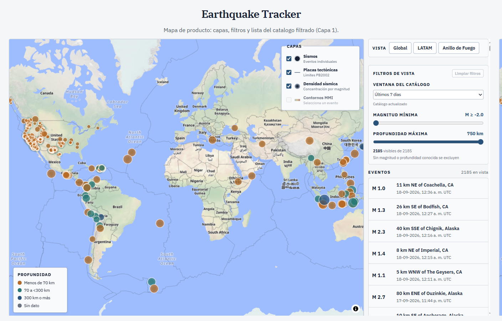

# Earthquake Tracker

Seismic visualization **2D → 3D**: USGS catalog through a BFF, multi-layer
operational map, and a local scene with depth (hypocenter) when you select an event.

Thesis: from the 2D map to tectonic volume. Not another globe with dots; there is a
data boundary and engineering behind it.

[](https://earthquake-tracker-siesquen.vercel.app)
[](https://github.com/JpSiesquen/earthquake-tracker-siesquen/actions/workflows/ci.yml)

**Demo:** https://earthquake-tracker-siesquen.vercel.app  
**Español:** [README.md](./README.md)



## Product

| Layer | What you get |
| --- | --- |
| **Map** | MapLibre: magnitude, depth, heatmap, plates, filters, list, `?event=` |
| **Scene** | R3F `/event/:id/3d`: honest plane, epicenter vs hypocenter, FDSN neighbors |
| **Products** | ShakeMap MMI, PAGER, DYFI; clean degradation when USGS has no data |

The browser never calls USGS directly: only the BFF (`/api/earthquakes`, `/:id`,
`/:id/shakemap`, `/search`) with Zod and cache.

## The hard parts

- Incomplete products → absent / loading / error / ready; no invented geometry
- Normalized DTO on the server; no raw `properties.products` tree
- No production DEM ([ADR](./docs/adr-dem.md)); the scene explains depth
- Neighbor M-t chart is exploratory, with a disclaimer (not prediction)

## Stack

Vite · React 19 · TypeScript · MapLibre 6 · Three / R3F / Drei · Zustand · TanStack
Query · React Router · Vercel BFF · oxlint · Prettier · Husky · Actions (`verificar`)

## Status

Layers 1-3 usable in the live demo. Desktop hero at `docs/assets/hero-desktop.png`.
Still open for portfolio close: short flow GIF (#113); optional sheet capture (#114).

## Development

```bash
npm ci
npm run hooks
npm run dev
```

Use `npm ci` + `npm run hooks` (Husky does not install itself: `ignore-scripts=true`).
See [`CONTRIBUTING.md`](./CONTRIBUTING.md#seguridad-de-dependencias).

Also: `npm run build` · `lint` · `format:check` · `test:local-coordinates` ·
`test:usgs-schema`.

## Docs

[`PRODUCT.md`](./PRODUCT.md) · [`CONTRIBUTING.md`](./CONTRIBUTING.md) ·
[`AGENTS.md`](./AGENTS.md) · [`docs/02-mapa-producto-capa-1.md`](./docs/02-mapa-producto-capa-1.md) ·
[`docs/04-escena-3d.md`](./docs/04-escena-3d.md) · [`docs/adr-dem.md`](./docs/adr-dem.md)
